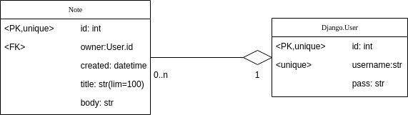

# Introduction
This is a simple Django REST API for managing notes. It is based off of Django and the 
[Django REST framework](https://www.django-rest-framework.org/).

# Installation
1. Install python 3.10 or similar.
2. Install requirements: `pip install -r requirements.txt`.

# Running
To set-up the database for the first time, use the following from the repository root:
```bash
cd note_project && python manage.py migrate
```
To run the server use the following from the repository root:
```bash
cd note_project && python manage.py runserver
```

Similarly, to run tests:
```bash
cd note_project && python manage.py test --pattern="test_*.py"
```

# Usage
The database follows the following schema:

<p align="center">
  
</p>

Here, the `Note` entity has a title, body and information on when it was created. It is also owned by one `User` entity
(a Django built-in). Each `User` can have 0 or more Notes.

The API provides the following endpoints for `User`:

- `GET /users/` - returns a list of all users.
- `POST /users/` - creates a new user.
- `GET /users/<id>/` - returns a single user.
- `DELETE /users/<id>/` - deletes a single user.


And the following endpoints for `Note`:
- `GET /notes/` - returns a list of all notes.
- `POST /notes/` - creates a new note.
- `GET /notes/<id>/` - returns a single note.
- `PUT /notes/<id>/` - updates a single note.
- `DELETE /notes/<id>/` - deletes a single note.
- `GET users/<user_id>/notes/` - returns a list of all notes owned by a user.


## Examples
To create a user run:
```bash
curl --location 'localhost:8000/users/' \
--header 'Content-Type: application/json' \
--data '{
    "username": "Joe"
}'
```

To create a note, determine the user's `<user_id>` (should be in the HTTP response of the above) and run:
```bash 
curl --location 'localhost:8000/notes/' \
--header 'Content-Type: application/json' \
--data '{
    "owner": <id>,
    "title" : "My Shopping List",
    "body": "BBQ sauce, garlic"
}'
```

To get the current notes for a user, run:
```bash
curl --location 'localhost:8000/users/<user_id>/notes'
```

# Caveats
This is a simple project not reflective of real-world settings, so there are a few caveats:
- Users are not authenticated, so anyone is authorised to access and modify any note.
- SQLite is used for simplicity, but it's not a good choice for production. 
- We would probably use uuids or something similar over integer ids in a real application.